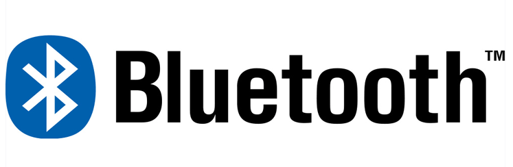
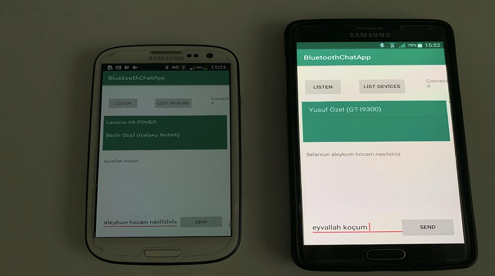
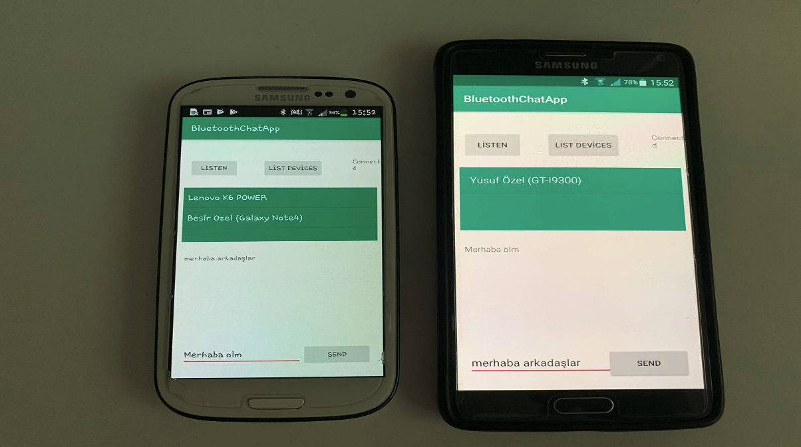

# Android Bluetooth 🌐 Chat 💬 App 📱

Android Bluetooth Chat application is an application written in Java programming language. It's a project created by synchronizing with chat to learn the Bluetooth structure.


## What is Bluetooth ⁉️



Bluetooth is a wireless communication technology that enables the wireless transmission of data over short distances. Bluetooth can communicate with 2.4 GHz using radio frequencies. Bluetooth technology can reach up to 10 meters of shooting capacity in an open area. Data transfer speeds between 1 Mbps and 721 Kbps are achieved in transfers with Bluetooth. <br>

1. Android OS supports networking via Bluetooth. It transfers data between devices using wireless communication.

2. By using Android Bluetooth APIs, we can easily access Bluetooth related functions.

3. It allows to connect to other devices using the Bluetooth API.


## What can we do using Bluetooth APIs ❓


- Scan for other Bluetooth devices
- Questioning Bluetooth devices paired with the device
- Transferring data with other devices
- Connecting to other devices with services
- Managing multiple wireless connections

## App 📱 Screenshots 📸 





## Donation 💸

If this project help 💁 you to develop, you can give me a cup of coffee. ☕

[](https://www.buymeacoffee.com/halilozel1903)

## License ℹ️
```
MIT License

Copyright (c) 2022 Halil OZEL

Permission is hereby granted, free of charge, to any person obtaining a copy
of this software and associated documentation files (the "Software"), to deal
in the Software without restriction, including without limitation the rights
to use, copy, modify, merge, publish, distribute, sublicense, and/or sell
copies of the Software, and to permit persons to whom the Software is
furnished to do so, subject to the following conditions:

The above copyright notice and this permission notice shall be included in all
copies or substantial portions of the Software.

THE SOFTWARE IS PROVIDED "AS IS", WITHOUT WARRANTY OF ANY KIND, EXPRESS OR
IMPLIED, INCLUDING BUT NOT LIMITED TO THE WARRANTIES OF MERCHANTABILITY,
FITNESS FOR A PARTICULAR PURPOSE AND NONINFRINGEMENT. IN NO EVENT SHALL THE
AUTHORS OR COPYRIGHT HOLDERS BE LIABLE FOR ANY CLAIM, DAMAGES OR OTHER
LIABILITY, WHETHER IN AN ACTION OF CONTRACT, TORT OR OTHERWISE, ARISING FROM,
OUT OF OR IN CONNECTION WITH THE SOFTWARE OR THE USE OR OTHER DEALINGS IN THE
SOFTWARE.
```
